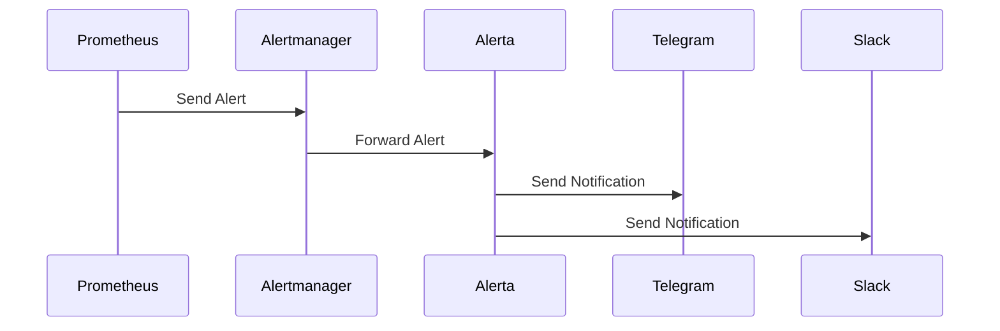

## Обзор

Система alerting в Cozystack объединяет Prometheus, Alertmanager и Alerta, обеспечивая полноценный мониторинг и уведомления. Alerts создаются на основе metrics, собранных VMAgent и сохраненных в VMCluster, затем проходят через Alertmanager для grouping и deduplication, а после этого управляются Alerta для отправки notifications через разные каналы, например Telegram и Slack.

### Поток alerting



## Настройка alerts в Alerta

Alerta - alerting system, интегрированная в monitoring stack Cozystack. Она обрабатывает alerts из разных sources и отправляет notifications через несколько channels.

### Alert rules

Alerts создаются на основе Prometheus rules, определенных в monitoring configuration. Custom alert rules можно настроить, изменив ресурсы PrometheusRule в namespace вашего tenant.

Чтобы создать custom alerts, определите PrometheusRule manifests с expressions, которые становятся true при выполнении alert condition. Каждое rule включает:

- **expr**: PromQL expression для вычисления.
- **for**: длительность, в течение которой условие должно быть true перед firing alert.
- **labels**: metadata, например severity.
- **annotations**: описательная информация для notifications.

Пример custom alert rule:

```yaml
apiVersion: monitoring.coreos.com/v1
kind: PrometheusRule
metadata:
  name: custom-alerts
  namespace: tenant-name
spec:
  groups:
  - name: custom.rules
    rules:
    - alert: HighCPUUsage
      expr: (1 - avg(rate(node_cpu_seconds_total{mode="idle"}[5m]))) * 100 > 80
      for: 5m
      labels:
        severity: warning
      annotations:
        summary: "Обнаружена высокая загрузка CPU"
        description: "Загрузка CPU выше 80% более 5 минут"
```

### Уровни severity

Alerta поддерживает следующие уровни severity:

- **informational**: низкоприоритетная информация
- **warning**: потенциальные проблемы, требующие внимания
- **critical**: срочные проблемы, требующие немедленных действий
- **major**: значимые проблемы, влияющие на эксплуатацию
- **minor**: небольшие проблемы

В конфигурации Alerta можно задать, какие severities вызывают notifications.

### Интеграции

#### Интеграция Telegram

Чтобы включить Telegram notifications, задайте следующее в настройках monitoring:

```yaml
alerta:
  alerts:
    telegram:
      token: "your-telegram-bot-token"
      chatID: "chat-id-1,chat-id-2"
      disabledSeverity:
        - informational
```

#### Интеграция Slack

Для Slack notifications:

```yaml
alerta:
  alerts:
    slack:
      url: "https://hooks.slack.com/services/YOUR/SLACK/WEBHOOK"
      disabledSeverity:
        - informational
        - warning
```

#### Интеграция Email

Чтобы включить email notifications:

```yaml
alerta:
  alerts:
    email:
      smtpHost: "smtp.example.com"
      smtpPort: 587
      smtpUser: "alerts@example.com"
      smtpPassword: "your-password"
      fromAddress: "alerts@example.com"
      toAddress: "team@example.com"
      disabledSeverity: 
        - informational
```

#### Интеграция PagerDuty

Для PagerDuty notifications:

```yaml
alerta:
  alerts:
    pagerduty:
      serviceKey: "YOUR_PAGERDUTY_INTEGRATION_KEY"
      disabledSeverity:
        - informational
        - warning
```

Подробные параметры конфигурации см. в [справочнике Monitoring Hub]({}).

## Примеры alerts

Ниже распространенные примеры alerts для system monitoring:

### Alert по CPU usage

```yaml
- alert: HighCPUUsage
  expr: 100 - (avg by(instance) (irate(node_cpu_seconds_total{mode="idle"}[5m])) * 100) > 80
  for: 5m
  labels:
    severity: warning
  annotations:
    summary: "Высокая загрузка CPU на {{ $labels.instance }}"
    description: "Загрузка CPU составляет {{ $value }}% более 5 минут"
```

### Alert по memory usage

```yaml
- alert: HighMemoryUsage
  expr: (1 - node_memory_MemAvailable_bytes / node_memory_MemTotal_bytes) * 100 > 90
  for: 5m
  labels:
    severity: critical
  annotations:
    summary: "Высокое использование памяти на {{ $labels.instance }}"
    description: "Использование памяти составляет {{ $value }}% более 5 минут"
```

### Alert по disk space

```yaml
- alert: LowDiskSpace
  expr: (node_filesystem_avail_bytes / node_filesystem_size_bytes) * 100 < 10
  for: 5m
  labels:
    severity: critical
  annotations:
    summary: "Мало свободного места на диске на {{ $labels.instance }}"
    description: "Доступное место на диске составляет {{ $value }}% более 5 минут"
```

### WorkloadNotOperational Alert

```yaml
- alert: WorkloadNotOperational
  expr: up{job="workload-monitor"} == 0
  for: 1m
  labels:
    severity: critical
  annotations:
    summary: "Workload {{ $labels.workload }} не работает"
    description: "Workload monitor сообщает, что workload недоступен"
```

### Alert по недоступному network interface

```yaml
- alert: NetworkInterfaceDown
  expr: node_network_up{device!~"lo"} == 0
  for: 2m
  labels:
    severity: critical
  annotations:
    summary: "Network interface {{ $labels.device }} недоступен на {{ $labels.instance }}"
    description: "Network interface недоступен более 2 минут"
```

### Alert по crash Kubernetes pod

```yaml
- alert: KubernetesPodCrashLooping
  expr: rate(kube_pod_container_status_restarts_total[10m]) > 0.5
  for: 5m
  labels:
    severity: warning
  annotations:
    summary: "Pod {{ $labels.pod }} находится в crash loop"
    description: "Pod перезапускается чаще одного раза за 2 минуты"
```

### Alert по высокой network latency

```yaml
- alert: HighNetworkLatency
  expr: node_network_receive_bytes_total / node_network_receive_packets_total > 1500
  for: 5m
  labels:
    severity: warning
  annotations:
    summary: "Высокая network latency на {{ $labels.instance }}"
    description: "Средний размер пакета превышает 1500 bytes, что может указывать на проблемы latency"
```

## Управление alerts

### Escalation

Alerts можно escalatе-ить на основе duration и severity. Настройте escalation policies в Alerta, чтобы автоматически повышать severity или уведомлять дополнительные channels, если alert остается нерешенным.

Escalation помогает гарантировать, что critical issues будут обработаны вовремя. Escalation rules можно определить на основе:

- Time thresholds, например escalation через 15 minutes
- Severity levels
- Alert attributes, например конкретные services или environments

Пример escalation configuration:

- Warning alerts переходят в critical через 30 минут
- Critical alerts немедленно уведомляют on-call personnel
- Major alerts уведомляют management через 1 час

Чтобы настроить escalation в Alerta, используйте web interface или API для настройки escalation policies для разных alert types.

### Suppression

Alerts можно временно suppress-ить с помощью функции silencing в Alerta. Это полезно во время maintenance windows, planned outages или при расследовании известных проблем без отправки notifications.

Silences можно создавать для конкретных alerts или на основе filters вроде environment, resource или event type. Silenced alerts остаются видимыми в dashboard Alerta, но не создают notifications.

Чтобы создать silence:

1. Откройте web interface Alerta
2. Перейдите в раздел Alerts
3. Выберите alert для silence или используйте filters, чтобы silence применился к нескольким alerts
4. Выберите "Silence" и задайте duration и reason

Либо используйте API:

```bash
curl -X POST https://alerta.example.com/api/v2/silences \
  -H "Authorization: Bearer YOUR_API_KEY" \
  -H "Content-Type: application/json" \
  -d '{
    "environment": "production",
    "resource": "server-01",
    "event": "HighCPUUsage",
    "startTime": "2023-12-01T00:00:00Z",
    "duration": 3600,
    "comment": "Scheduled maintenance"
  }'
```

Silences также можно управлять через Alertmanager для более продвинутого suppression на основе routing.

## Конфигурация Alertmanager

Alertmanager выполняет routing, grouping и deduplication alerts перед отправкой notifications. Он работает как посредник между Prometheus и notification systems вроде Alerta.

### Grouping

Alerts можно группировать по labels, чтобы снизить noise и предотвратить alert fatigue. Настройте grouping в конфигурации Alertmanager:

```yaml
route:
  group_by: ['alertname', 'cluster', 'namespace']
  group_wait: 10s
  group_interval: 10s
  repeat_interval: 1h
  receiver: 'default'
```

- **group_by**: labels, по которым группируются alerts
- **group_wait**: время ожидания перед отправкой первого notification
- **group_interval**: interval между notifications для одной группы
- **repeat_interval**: минимальное время между notifications

### Routing

Route alerts к разным receivers на основе labels, чтобы отправлять targeted notifications:

```yaml
route:
  receiver: 'default'
  routes:
  - match:
      severity: critical
    receiver: 'critical-alerts'
  - match:
      team: devops
    receiver: 'devops-team'
  - match_re:
      namespace: 'kube-.*'
    receiver: 'kubernetes-alerts'

receivers:
- name: 'default'
  slack_configs:
  - api_url: 'https://hooks.slack.com/services/YOUR/SLACK/WEBHOOK'
    channel: '#alerts'
- name: 'critical-alerts'
  pagerduty_configs:
  - service_key: 'YOUR_PAGERDUTY_KEY'
- name: 'devops-team'
  email_configs:
  - to: 'devops@example.com'
    from: 'alertmanager@example.com'
    smarthost: 'smtp.example.com:587'
    auth_username: 'alertmanager@example.com'
    auth_password: 'password'
- name: 'kubernetes-alerts'
  webhook_configs:
  - url: 'http://alerta.example.com/api/webhooks/prometheus'
    send_resolved: true
```

### Inhibition

Используйте inhibition rules, чтобы подавлять одни alerts, когда сработали другие связанные alerts:

```yaml
inhibit_rules:
- source_match:
    alertname: 'NodeDown'
  target_match:
    alertname: 'PodCrashLooping'
  equal: ['node']
```

Подробнее о конфигурации Alertmanager см. в [официальной документации](https://prometheus.io/docs/alerting/latest/alertmanager/).
