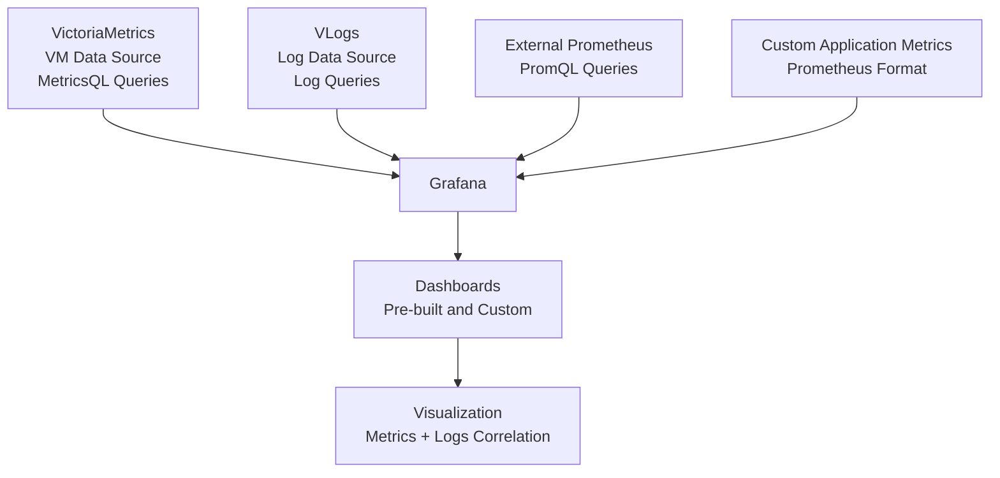

## Обзор

Cozystack интегрирует Grafana как основной инструмент визуализации metrics, собираемых VictoriaMetrics (VM). В этом разделе описан доступ к pre-built dashboards, создание custom visualizations и интеграция external data sources для полноценной наблюдаемости кластеров и приложений Cozystack.

## Доступ к Grafana

Чтобы открыть Grafana и посмотреть dashboards:

1. Перейдите по URL Grafana: `https://grafana.<tenant-domain>`, где `<tenant-domain>` - домен вашего tenant.
2. Войдите с tenant credentials (OIDC или token-based authentication).
3. После входа pre-configured dashboards доступны в разделе "Dashboards".

Первичную настройку и детали конфигурации см. в [Monitoring Setup]({}).

## Pre-built dashboards

Cozystack предоставляет набор pre-configured dashboards в Grafana, которые автоматически разворачиваются и обновляются через monitoring stack. Эти dashboards определены в файле `packages/extra/monitoring/dashboards.list` и сразу дают представление о производительности системы и приложений.

### Dashboards инфраструктуры кластера

- **Kubernetes Cluster Overview**: дает верхнеуровневый обзор всего Kubernetes-кластера, включая status узлов, health pods, использование CPU/memory/disk по кластеру и производительность API server. Полезен для быстрой проверки health и поиска resource bottlenecks в кластере.
- **Node Metrics**: подробные метрики по узлам: CPU usage, memory consumption, disk I/O, network traffic и system load. Включает panels для отдельных узлов и агрегированные представления. Подходит для диагностики проблем конкретного узла.
- **ETCD Metrics**: мониторит health кластера ETCD, включая latency, storage usage, leader elections и database operations. Важен для надежности данных Kubernetes control plane.
- **Storage Metrics**: показывает компоненты хранения, такие как Linstor и SeaweedFS: volume usage, I/O operations, replication status и performance metrics. Помогает управлять storage resources и диагностировать storage-related проблемы.

### Dashboards приложений и сервисов

- **Tenant Applications**: настраиваемые dashboards для пользовательских приложений, показывающие request rates, error rates, response times и throughput. Поддерживают web services, APIs и microservices, работающие в tenant namespaces.
- **Service Mesh**: метрики сетевых компонентов, включая ingress controllers (например, NGINX, Traefik), load balancers и service mesh proxies. Покрывают traffic patterns, latency, error rates и connectivity health.
- **Database Metrics**: специализированные dashboards для поддерживаемых баз данных, таких как PostgreSQL, MySQL, Redis и других. Включают query performance, connection counts, cache hit rates и storage metrics. Например, dashboard PostgreSQL показывает active connections, slow queries и replication status.

Эти dashboards регулярно обновляются в новых релизах. Скриншоты и визуальные примеры см. в release notes с preview dashboards в [блоге Cozystack](https://cozystack.io/blog/).

## Создание custom dashboards

Если pre-built dashboards не покрывают ваши потребности, можно создавать custom dashboards в Grafana, чтобы визуализировать конкретные metrics или объединять данные из нескольких sources.

### Шаги создания custom dashboard

1. **Откройте Grafana**: войдите в Grafana с tenant credentials.
2. **Создайте новый dashboard**: нажмите значок "+" в боковой панели и выберите "Dashboard".
3. **Добавьте panels**: нажмите "Add new panel", чтобы создать visualizations. Выберите тип panel и настройте data sources.
4. **Настройте queries**: используйте MetricsQL (язык запросов VictoriaMetrics) для получения и преобразования данных.
5. **Настройте layout**: расположите panels, задайте time ranges и добавьте annotations или variables для интерактивности.
6. **Сохраните и поделитесь**: сохраните dashboard, настройте permissions и при необходимости экспортируйте его для повторного использования.


### Примеры queries

Ниже несколько распространенных MetricsQL queries для custom panels:

- **Использование CPU pod**:
  ```promql
  rate(container_cpu_usage_seconds_total{pod=~"$pod"}[5m])
  ```
  Показывает CPU usage rate для выбранных pods во времени.

- **Процент использования memory**:
  ```promql
  (1 - node_memory_MemAvailable_bytes / node_memory_MemTotal_bytes) * 100
  ```
  Показывает memory utilization на узлах в процентах.

- **Network traffic**:
  ```promql
  rate(node_network_receive_bytes_total[5m]) + rate(node_network_transmit_bytes_total[5m])
  ```
  Мониторит входящий и исходящий network traffic.

- **Response time приложения**:
  ```promql
  histogram_quantile(0.95, rate(http_request_duration_seconds_bucket{job="my-app"}[5m]))
  ```
  Вычисляет 95-й percentile response time для приложения.

### Типы panels и best practices

- **Time Series (Graph)**: подходит для trends во времени, например CPU usage или request rates. Используйте для визуализации historical data.
- **Stat**: показывает одиночные значения, например текущий процент CPU или общее число requests. Удобен для быстрых метрик.
- **Table**: показывает табличные данные, например top processes или alert summaries. Полезен для подробных списков.
- **Heatmap**: визуализирует density, например error rates по временным интервалам. Эффективен для поиска patterns.
- **Gauge**: представляет значения на шкале, например процент использования диска.

При создании panels учитывайте:
- Используйте подходящие time ranges и refresh intervals.
- Добавляйте thresholds и alerts прямо в panels для proactive monitoring.
- Используйте variables для динамической фильтрации, например по namespace или имени pod.

Расширенные queries и functions см. в [документации VictoriaMetrics MetricsQL](https://docs.victoriametrics.com/MetricsQL.html).

## Интеграция external data sources

Cozystack позволяет интегрироваться с внешними monitoring systems, чтобы централизовать observability.

### Добавление External Prometheus

Чтобы интегрировать внешний экземпляр Prometheus:

1. В Grafana перейдите в "Configuration" > "Data Sources" > "Add data source".
2. Выберите тип "Prometheus".
3. Укажите URL внешнего Prometheus, данные аутентификации (если требуются) и scrape interval.
4. Проверьте соединение и сохраните.
5. Используйте PromQL в dashboards, чтобы запрашивать внешние данные.

### Custom application metrics

Для приложений, предоставляющих custom metrics:

- Убедитесь, что приложение предоставляет метрики в формате Prometheus, например через endpoint `/metrics`.
- Настройте VMAgent в Cozystack на scraping этих endpoints, обновив monitoring configuration.
- Метрики будут загружены в VM и доступны для query в Grafana.

Для совместимости соблюдайте [metric naming conventions](https://prometheus.io/docs/practices/naming/) Prometheus. Примеры конфигурации см. в [Monitoring Hub Reference]({}).

### Интеграция Grafana data sources

Эта диаграмма показывает, как external data sources интегрируются в Grafana для централизованного мониторинга.



## Конфигурация data sources

Grafana в Cozystack заранее настроена с оптимизированными data sources для бесшовной интеграции.

### VictoriaMetrics (VM) Data Source

- **Type**: Prometheus-compatible (MetricsQL).
- **URL**: внутренний endpoint VM cluster в namespace tenant.
- **Authentication**: автоматическая через service account tokens.
- **Usage**: основной source для time-series metrics. Поддерживает высокопроизводительные querying и aggregation.

### VLogs Data Source

- **Type**: custom plugin для log querying.
- **Purpose**: включает визуализацию логов и корреляцию с metrics.
- **Configuration**: автоматически настраивается для tenant-specific log streams.
- **Usage**: добавляйте log panels в dashboards, чтобы объединять metrics и logs, например для troubleshooting проблем приложений.

Чтобы изменить настройки data source, откройте Grafana admin panel (нужны admin privileges) или обновите monitoring configuration через Cozystack API. Подробные параметры см. в [Monitoring Hub Reference]({}).
